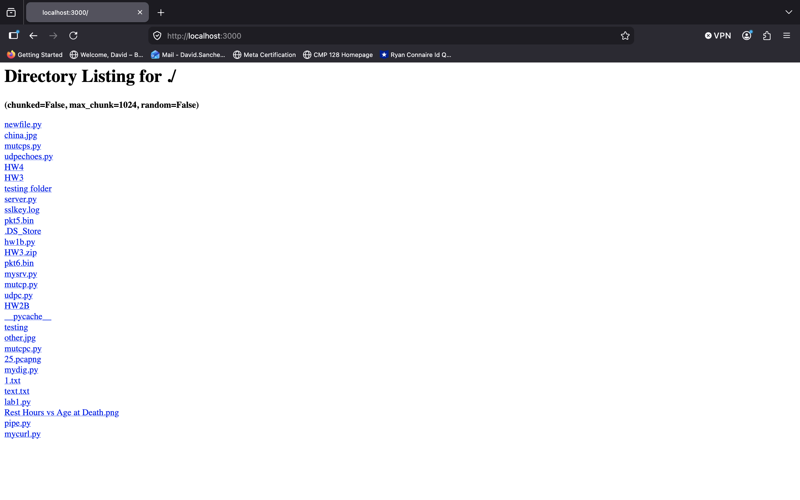
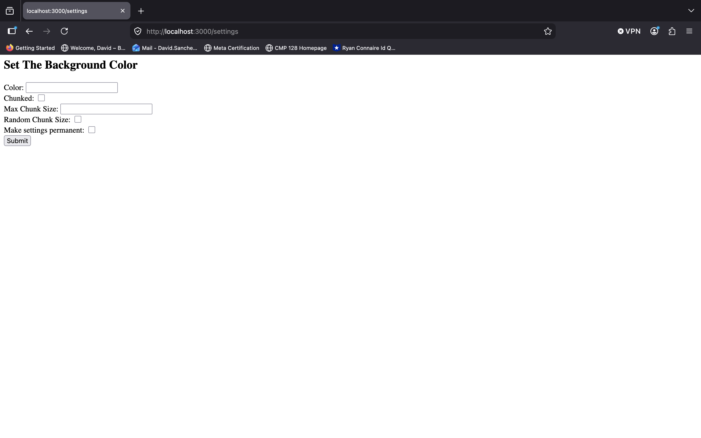
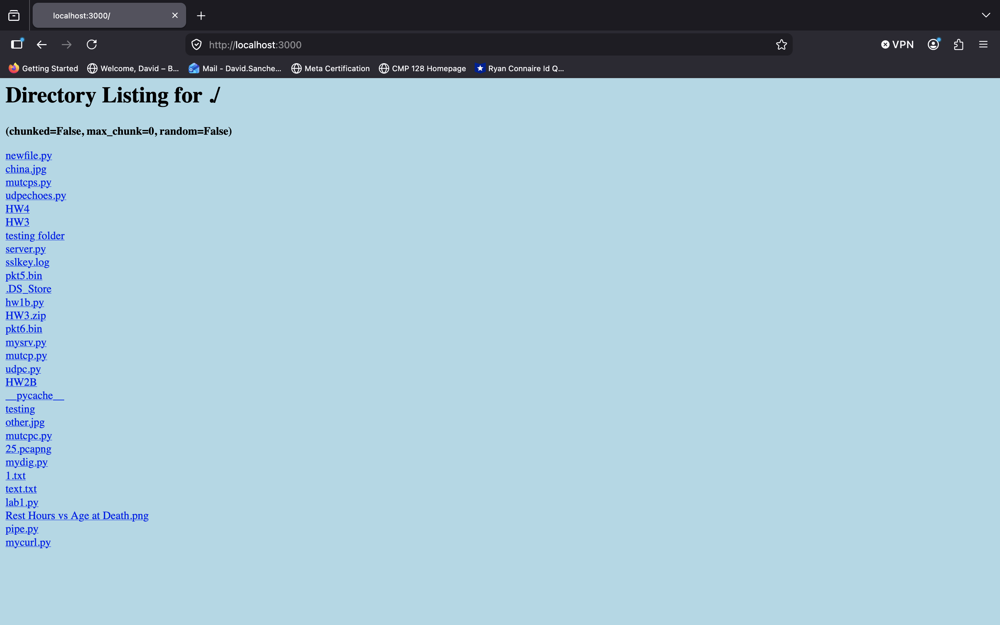
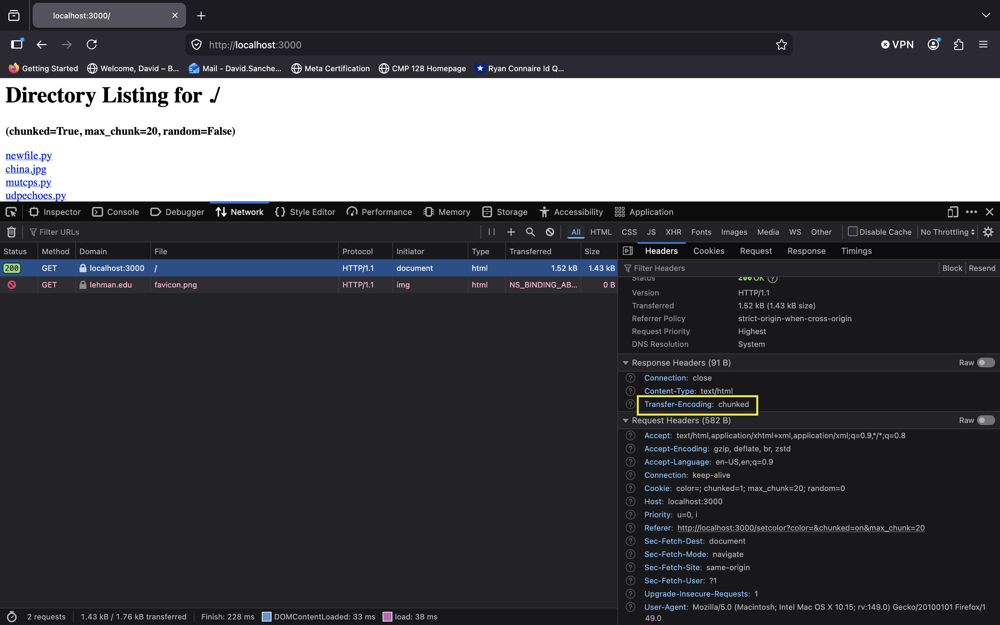

# Python-HTTP-FIle-Explorer-Server

A custom HTTP/1.1 web server built in Python using low-level socket programming. The server supports directory browsing, file retrieval, cookie-based user settings, and HTTP chunked transfer encoding for both text and binary content.

---

## Features

* Handles HTTP/1.1 requests and responses
* Serves files and directory listings through a web browser
* Generates custom HTML directory index pages
* Returns custom 404 error pages for invalid paths
* Detects and sets MIME content types automatically
* Supports cookie-based user preferences
* Implements session and persistent cookies
* Allows customization of page background color
* Supports HTTP chunked transfer encoding
* Configurable maximum chunk sizes
* Optional randomized chunk sizes
* Handles both text and binary files
* Uses persistent TCP connections with manual request parsing

---

## Technologies

* Python
* Socket Programming
* TCP/IP
* HTTP/1.1
* Cookies
* Chunked Transfer Encoding
* MIME Types

---

## Architecture

```text
Browser
    ↓
TCP Connection
    ↓
Python Socket Server
    ↓
HTTP Request Parsing
    ↓
Directory Listing / File Retrieval
    ↓
HTTP Response Generation
```

---

## Directory Browsing

The server provides file explorer functionality similar to Python's built-in HTTP server.

* Displays directory contents in the browser
* Supports navigation through subdirectories
* Returns files with the appropriate content type
* Generates custom HTML directory listings

---

## Cookie-Based Settings

A settings page allows users to configure:

* Background color
* Session or persistent cookies
* Chunked transfer encoding
* Maximum chunk size
* Randomized chunk sizes

User preferences are stored using HTTP cookies and automatically applied to future requests.

---

## HTTP Chunked Transfer Encoding

The server implements HTTP chunked transfer encoding without using external HTTP libraries.

Features include:

* Standard chunked responses
* Configurable chunk sizes
* Random chunk size generation
* Support for binary and text data
* Proper hexadecimal chunk size formatting
* Correct termination using the zero-length chunk

---

## Example Chunked Response

```http
HTTP/1.1 200 OK
Transfer-Encoding: chunked

4
Wiki
5
pedia
0
```

---

## Running the Server in the Terminal

```bash
python server.py
```
or
```bash
python3 server.py
```
Default port:

```text
3000
```

Specify a custom port:

```bash
python server.py 8080
```
or
```bash
python3 server.py 8080
```
---

## Example Usage

Open a browser and navigate to:

```text
http://localhost:3000
```

Access the settings page by visiting:

```text
http://localhost:3000/settings
```

Alternatively, you can click the **Settings** button on the home page.
## Future Improvements

* Multi-threaded connection handling
* POST request support
* File upload capability
* HTTPS support
* Connection persistence
* Logging and monitoring

---

## Screenshots

### Directory Listing



### Settings Page



### Cookie-Based Customization/Background Change


User preferences are stored using HTTP cookies and automatically applied to future requests.

### Chunked Transfer Encoding


Verified HTTP chunked transfer encoding using browser developer tools.
